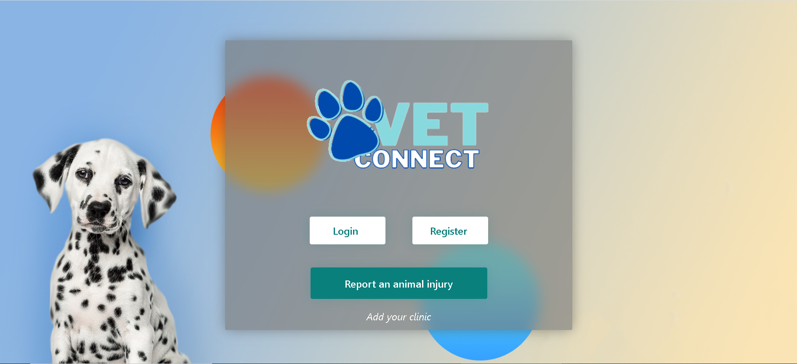
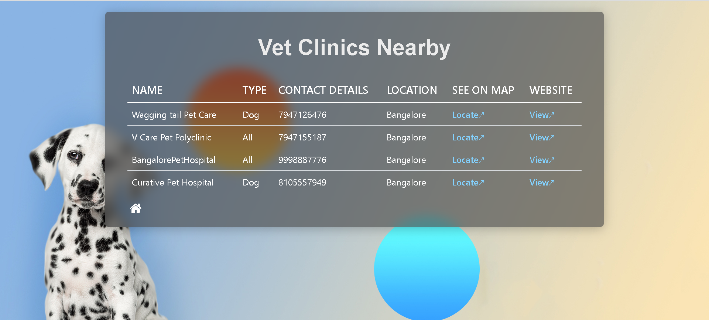
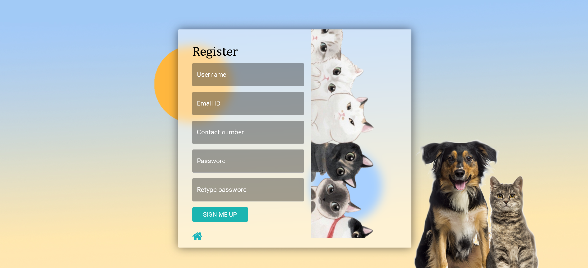
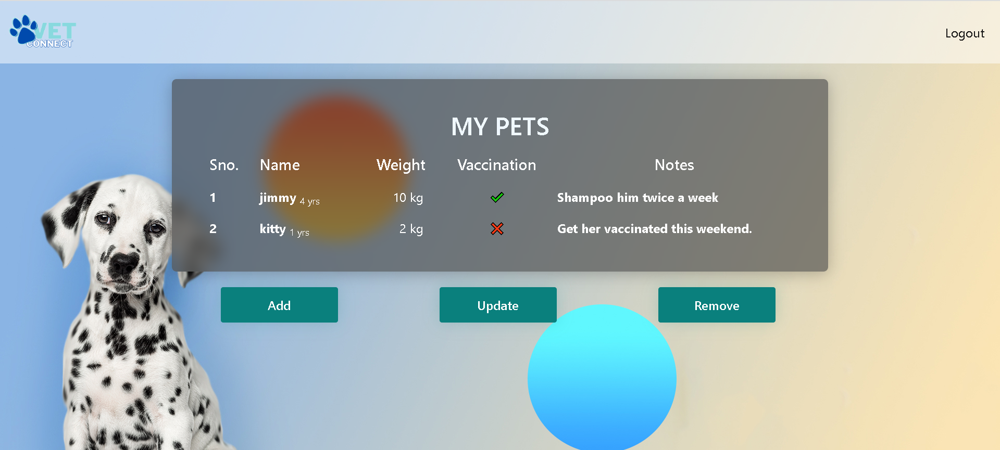

# [VETCONNECT](https://vetconnect.pythonanywhere.com/)
### by [Vijay Varadarajan](https://github.com/vijay-varadarajan)
### with [Gaurav Choudhary](https://github.com/Gaurav-Choudhary2113), [Keshav Kartha](https://github.com/KeshavKartha),  and [Ayush Mishra](https://github.com/Ayush-07-Mishra)
### from TamilNadu, India

#### Website: [VetConnect-site](https://vetconnect.pythonanywhere.com/)
#### Video demo: [VetConnect-video_demo](https://www.youtube.com/watch?v=3GQp6SWrqrI)
#### Github repo link: [VetConnect-source_code](https://github.com/vijay-varadarajan/VetConnect)

## About this project
This is a web application made to promote veterinary healthcare and pet health in India. The main aim of this project is to increase awareness about animal health among the public. 

The website primarily allows any user to submit a report about a stray or injured animal and the user receives a list of nearby veterinary hospitals/clinics with contact details and directions.

Legitimate veterinary hospitals with valid authentication IDs can add their hospital names to the database through the same website.

In addition to this, the user can sign up and store details of their pet(s) in the database and can access and modify it anytime they want. This allows users to keep track of their pet's needs and cater to the same.

## Features

+ The cursor is modified to look like a **cat's paw**  , matching the website's theme.

+ Allows **quick helping** without needing to login.

+ Sorts **nearby veterinary clinics/hospitals** based on the type of pet and distance.

+ Displays **names**, **contact details**, **web link** and **map location** of veterinary clinics nearby.

+ The **authentication ID** of hospitals is checked while adding.

+ Uses the **Haversine formula** to calculate the distance between two locations.

+ Lets users signup to **store details of his/her pet(s)**.

+ Stores users passwords in **encrypted form**.

+ Lets users **reset thier passwords** if forgotten.

+ Gives each user their own **table** to store pet(s) details.

+ Lets users **modify / delete** the added details.

+ Checks for **invalid data** at all input fields and works accordingly.

## Installation requirements

<b> Framework used: </b> Flask

The following dependencies must be installed using pip to run this web application.
<details>

<summary><b>Python dependencies</b></summary>

 - math
 - functools
 - Werkzeug
 - geopy
 - cs50
 - Flask
 - Flask-Session2

</details>

## Working / Usage instructions

1. Upon opening, the homepage of this website has buttons to take you to '**login**', '**register**', '**report**' and '**add vet clinic**' pages.



2. The **Help an animal** section requires you to fill a form with the details of their location and the trivial details of the animal found.

3. After submitting the report, you can see the **list of veterinary hospitals/clinics** near your location, sorted by **distance**.



4. This table also provides the **contact details**, link to the **location** on google maps and a web link to the **website** of each hospital.

5. From the homepage, a user can also add their hospital details through the '**add your vet clinic**' link, provided their hospital is a legitimate veterinary centre. This is confirmed with an **authentication ID**, that is unique to this website.

6. The **register page** requires you to create a new unique username and password along with their email ID and contact, to signup to the website.



7. The **login page** requires you to login with the registerd username and password. It also allows you to reset your password if you forget it, through the '**Forgot password**' link which takes you to the **reset password** page.

8. The page to **reset password** asks you for your username, mail ID and phone number which is checked against the database and if legit, the old hashed password is replaced with the newly obtained hashed password, effectively changing your password.

9. After logging in / registering, Your **homepage** will display the stored details of your pets in a tabular format.



10. You can add details of your pets such as: name, age, weight, vaccination status and additional notes as well, through '**Add your pet**'

11. These details can be modified through '**Update**' where you have the ability to modify certain details of the pet you need to change.

12. The '**Remove**' page allows you to remove a pet from the list, by specifing the name of the pet to remove.


## Implementation details

### _**app.py**_

This file includes the full code for the backend processing of this web application. This involves importing the required python libraries, defining the functions of all the different routes of this application along with wrapper functions for specific requirements such as **login required()**. We obtain the user's location using **Nominatim** from **geopy.geocoders**. 

```python
def get_coords(locality, city, state):
    location = geolocator.geocode(f"{locality}, {city}, {state}")

    lat1 = location.latitude    #user latitude
    long1 = location.longitude  #user longitude
    
    return lat1, long1
```

It also contains the handwritten function to calculate the distance between two locations using the **Haversine formula**. This way, the distance calculated is highly accurate.

```python
def distance(lat1, long1, lat2, long2):

    R = 6371 # Radius of the earth in km

    Latdiff = math.radians(lat2-lat1)
    Longdiff = math.radians(long2-long1)
    
    calc1 = math.sin(Latdiff/2) * math.sin(Latdiff/2) + math.cos(math.radians(lat1))* math.cos(math.radians(lat2)) * math.sin(Longdiff/2) * math.sin(Longdiff/2)
    
    distance = R * 2 * math.atan2(math.sqrt(calc1), math.sqrt(1-calc1)) 

    return distance
```

Each of the functions for the different routes of this application perform respective tasks of either **rendering a HTML template** when called via '**GET**' method or **submitting a form** when called via '**POST**'. The details submitted are then checked according to the process and the database is updated whenever needed through **sql queries** using **SQL** from **cs50**.

### _**static**_

This folder contains all the static files necessary for this web application. This includes the following **css files**: 

 - **login.css**: stylesheet for the login page

 - **register.css**: stylesheet for the register page
 
 - **report.css**: stylesheet for report page
 
 - **styles.css**: stylesheet for all the remaining pages

This also includes the **background images** as well as the images for the **logo** and the **modified cursor**. 


### _**templates**_
This folder contains the html templates for all the different routes in this web application. Most of the css for these pages are linked from the files in static while some are borrowed from [bootstrap](https://getbootstrap.com) and [font-awesome](https://cdnjs.cloudflare.com/ajax/libs/font-awesome/4.7.0/css/font-awesome.min.css)

The **navbar** displayed on top of user's homepage after login uses bootstrap's navbar documentation while the **house icon** in 'login', 'register' and 'report' pages is obtained from font-awesome.

### _**vet.db**_
This is the database that is used to store all the user and hospital information entered into this web application. This database contains the following tables: 

 * ### users
    This stores the **information about the user** while registering which includes the ID, username, email ID, contact number and hashed password.

    This table is used every time the user logs in to check if the username and password match with the stored info for **valid authentication**.

 * ### HospitalInfo
    This table contains the **information of the veterinary hospitals** that are added by users with a valid authentication ID. The info includes the name of the hospital, type (specific animal), coordinates, contact number, website and a link to google maps location (that is autogenerated based on the coordinates given).

 * In addition to the above, **when the user registers for the first time, a new table is created** for him/her to store the details of their pets. The details include: name, age, weight, vaccination_status and notes.

### _**requirements.txt**_
This file contains the names of the required python dependencies that need to be installed before launching this web application.

## References

 - [Geopy](https://pypi.org/project/geopy/)
 - [Werkzeug](https://pypi.org/project/Werkzeug/)
 - [Math behind Haversine formula](https://community.esri.com/t5/coordinate-reference-systems-blog/distance-on-a-sphere-the-haversine-formula/ba-p/902128#:~:text=For%20example%2C%20haversine(%CE%B8),longitude%20of%20the%20two%20points.)
 - [Haversine formula](https://en.wikipedia.org/wiki/Haversine_formula)
 - [SQL](https://www.w3schools.com/sql/)
 - [Bootstrap](https://www.getbootstrap.com)
